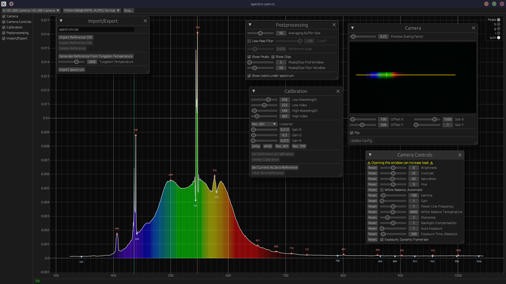

# **WIP**
# spectro-cam-rs

A cross-platform GUI for webcam-based spectrometers.

# License

This program is licensed under either of

- Apache License, Version 2.0 ([LICENSE-APACHE](LICENSE-APACHE) or
  http://www.apache.org/licenses/LICENSE-2.0)

- MIT license ([LICENSE-MIT](LICENSE-MIT) or http://opensource.org/licenses/MIT)

at your option.

## Contribution

Unless you explicitly state otherwise, any contribution intentionally submitted
for inclusion in the work by you, as defined in the Apache-2.0 license, shall be
dual licensed as above, without any additional terms or conditions.

## Code of Conduct

Contribution to this crate is organized under the terms of the [Rust Code of
Conduct][CoC], the maintainer of this crate, [DerFetzer][team], promises
to intervene to uphold that code of conduct.

[CoC]: https://www.rust-lang.org/policies/code-of-conduct
[team]: https://github.com/DerFetzer
